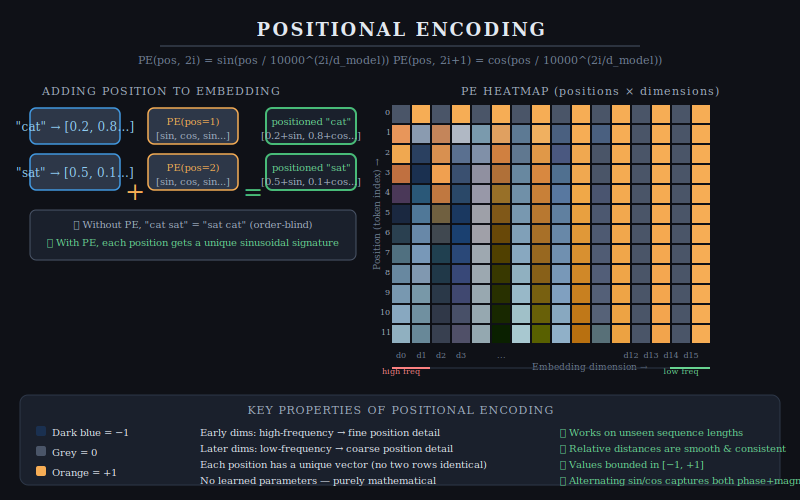
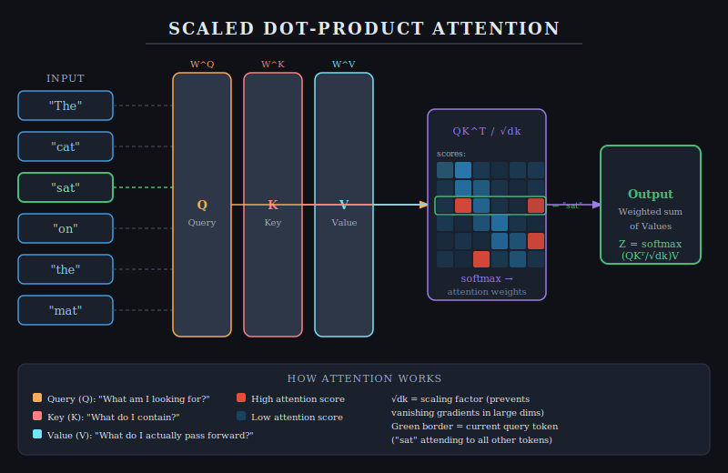

# Transformer Networks

## 1. Introduction

The **Transformer** is a deep learning architecture introduced in the 2017 paper *"Attention Is All You Need"* by Vaswani et al. (Google Brain). It fundamentally changed natural language processing — and AI more broadly — by replacing sequential recurrence (RNNs, LSTMs) with a mechanism called **self-attention**, which allows the model to relate any position in a sequence to any other position directly, regardless of distance.

Unlike RNNs that process tokens one at a time (left to right), Transformers process **all tokens in parallel**, making them dramatically faster to train on modern hardware (GPUs/TPUs). This parallelism, combined with the ability to capture long-range dependencies, led to the rise of large language models (LLMs) such as BERT, GPT, and T5 — all built on the Transformer architecture.

Today, Transformers dominate not only NLP but also computer vision (ViT), audio (Whisper), protein folding (AlphaFold), and increasingly, **cybersecurity**.

---

## 2. Architecture Overview

The original Transformer follows an **encoder–decoder** structure, though many modern variants use only the encoder (e.g., BERT for classification) or only the decoder (e.g., GPT for generation).

```
Input Tokens
     ↓
[Token Embedding] + [Positional Encoding]
     ↓
┌────────────────────────────┐
│         ENCODER            │  × N layers
│  ┌──────────────────────┐  │
│  │  Multi-Head Attention │  │
│  └──────────┬───────────┘  │
│       Add & LayerNorm       │
│  ┌──────────────────────┐  │
│  │  Feed-Forward Network│  │
│  └──────────┬───────────┘  │
│       Add & LayerNorm       │
└────────────────────────────┘
     ↓
┌────────────────────────────┐
│         DECODER            │  × N layers
│  Masked Multi-Head Attn     │
│  Cross-Attention (Enc↔Dec) │
│  Feed-Forward Network       │
└────────────────────────────┘
     ↓
  Linear + Softmax
     ↓
Output Probabilities
```

---

## 3. Core Components

### 3.1 Token Embeddings

Each input token (word or subword) is mapped to a dense vector of dimension `d_model` (commonly 512 or 768). These embeddings are **learned** during training.

### 3.2 Positional Encoding

Because the Transformer has no recurrence or convolution, it has no inherent notion of order. **Positional encodings** are added to the token embeddings to inject sequence position information.

The original paper uses fixed sinusoidal functions:

```
PE(pos, 2i)   = sin(pos / 10000^(2i / d_model))
PE(pos, 2i+1) = cos(pos / 10000^(2i / d_model))
```

- `pos` = position of the token in the sequence  
- `i` = dimension index  
- Different frequencies encode different positional scales — high-frequency dimensions capture fine positional detail; low-frequency dimensions capture coarse structure

**Visualization:**

  
*Figure 1: Heatmap of positional encoding values across token positions (rows) and embedding dimensions (columns). Early dimensions oscillate rapidly (high frequency); later dimensions change slowly (low frequency), giving each position a unique, smooth signature.*

---

### 3.3 Self-Attention Mechanism

This is the heart of the Transformer. For each token, self-attention computes how much it should "attend to" every other token in the sequence when building its representation.

Each token embedding is projected into three vectors via learned weight matrices:

| Vector | Symbol | Role |
|--------|--------|------|
| Query  | **Q**  | "What am I looking for?" |
| Key    | **K**  | "What do I contain?" |
| Value  | **V**  | "What do I pass forward?" |

The attention output is computed as:

```
Attention(Q, K, V) = softmax( QKᵀ / √d_k ) · V
```

- `QKᵀ` computes dot-product similarity scores between all query-key pairs  
- Dividing by `√d_k` prevents gradients from vanishing in high-dimensional spaces  
- `softmax` normalizes scores into a probability distribution (attention weights)  
- The output is a **weighted sum of Values**, where high-attention tokens contribute more

**Visualization:**

  
*Figure 2: Scaled dot-product attention. Input tokens are projected into Q, K, V matrices. QKᵀ/√dk produces a score matrix (heatmap), normalized by softmax to form attention weights. The weighted sum of V produces context-aware output representations. The green-bordered row shows token "sat" attending to all other tokens.*

---

### 3.4 Multi-Head Attention

Instead of computing one attention function, the model runs **h** attention heads in parallel, each learning different relational patterns (e.g., syntactic vs. semantic):

```
MultiHead(Q, K, V) = Concat(head₁, ..., headₕ) · Wᴼ
```

Each head operates on a lower-dimensional projection (`d_model / h`), keeping computational cost constant.

### 3.5 Feed-Forward Network (FFN)

After attention, each position passes independently through a two-layer fully connected network:

```
FFN(x) = max(0, xW₁ + b₁) · W₂ + b₂
```

This adds non-linearity and extra representational capacity.

### 3.6 Residual Connections & Layer Normalization

Each sub-layer (attention + FFN) is wrapped with:

```
output = LayerNorm(x + Sublayer(x))
```

- **Residual connections** allow gradients to flow directly, enabling deep networks  
- **Layer normalization** stabilizes training by normalizing activations

---

## 4. Training

Transformers are typically trained in two stages:

1. **Pre-training** — on massive unlabeled corpora using self-supervised objectives (e.g., masked language modeling for BERT, next-token prediction for GPT)
2. **Fine-tuning** — on smaller, labeled task-specific datasets

Optimizers: **Adam** with learning rate warmup + decay.  
Loss: Cross-entropy for classification/language modeling tasks.

---

## 5. Applications in Cybersecurity

Transformers have become a powerful tool across multiple cybersecurity domains:

### 5.1 Intrusion Detection Systems (IDS)

Network traffic logs can be treated as sequences of events or tokens. Transformers learn contextual patterns across time windows to distinguish normal traffic from attacks (DoS, port scans, data exfiltration). Models trained on datasets like **NSL-KDD** or **CICIDS** achieve high accuracy with fewer false positives than traditional rule-based systems.

### 5.2 Malware Detection and Classification

Malware binary files can be converted into byte sequences or disassembly token streams. Transformers such as **BERT-based malware classifiers** learn the "grammar" of malicious code patterns without hand-crafted features, outperforming signature-based antivirus on zero-day samples.

### 5.3 Phishing & Spam URL/Email Detection

Transformer language models analyze the full contextual content of emails or URLs, capturing subtle linguistic and structural cues (e.g., urgent phrasing, domain lookalikes) that simpler models miss. Fine-tuned BERT models are now standard in enterprise email security pipelines.

### 5.4 Vulnerability Detection in Source Code

Models like **CodeBERT** and **GraphCodeBERT** are pre-trained on source code and fine-tuned to detect Common Weakness Enumeration (CWE) vulnerabilities (buffer overflows, SQL injections, etc.) directly from source, significantly accelerating code review.

### 5.5 Log Analysis and Threat Hunting

Security Operations Centers (SOCs) generate enormous volumes of SIEM logs. Transformers can model normal system behavior, flag anomalous log sequences, and correlate events across thousands of log lines — tasks that are impractical for human analysts at scale.

### 5.6 Large Language Models as Security Assistants

General-purpose LLMs (GPT-4, Claude) assist security professionals with CTF challenges, reverse engineering, writing detection rules (Sigma/YARA), and automated vulnerability report triage.

---

## 6. Advantages Over Earlier Models

| Property | RNN / LSTM | CNN | Transformer |
|---|---|---|---|
| Long-range dependencies | Poor (vanishing gradients) | Limited (fixed receptive field) | **Excellent** (direct attention) |
| Parallelization | Sequential | Partially parallel | **Fully parallel** |
| Scalability | Limited | Moderate | **Scales to billions of params** |
| Transfer learning | Difficult | Moderate | **Highly effective** |
| Interpretability | Low | Low | Moderate (attention weights) |

---

## 7. Limitations

- **Quadratic complexity** in sequence length: `O(n²)` memory/compute for attention — challenging for very long sequences (addressed by variants like Longformer, Linformer)
- **Data hunger**: requires large amounts of pre-training data
- **Computational cost**: training large Transformers demands significant GPU resources
- **Positional encoding generalization**: sinusoidal encodings can struggle with sequences much longer than seen during training (addressed by RoPE, ALiBi)

---

## 8. Conclusion

The Transformer architecture, built on positional encodings and self-attention, represents a paradigm shift in sequence modeling. Its ability to capture global context in parallel has enabled breakthroughs across language, vision, and science. In cybersecurity, Transformers are increasingly applied to intrusion detection, malware analysis, vulnerability discovery, and automated threat intelligence — replacing brittle rule-based systems with adaptive, context-aware models. As the field matures, Transformer-based security tools will become standard components of enterprise defense pipelines.

---

## References

- Vaswani, A., et al. (2017). *Attention Is All You Need*. NeurIPS.  
- Devlin, J., et al. (2019). *BERT: Pre-training of Deep Bidirectional Transformers*. NAACL.  
- Brown, T., et al. (2020). *Language Models are Few-Shot Learners* (GPT-3). NeurIPS.  
- NSL-KDD Dataset: https://www.unb.ca/cic/datasets/nsl.html  
- CICIDS2017 Dataset: https://www.unb.ca/cic/datasets/ids-2017.html
