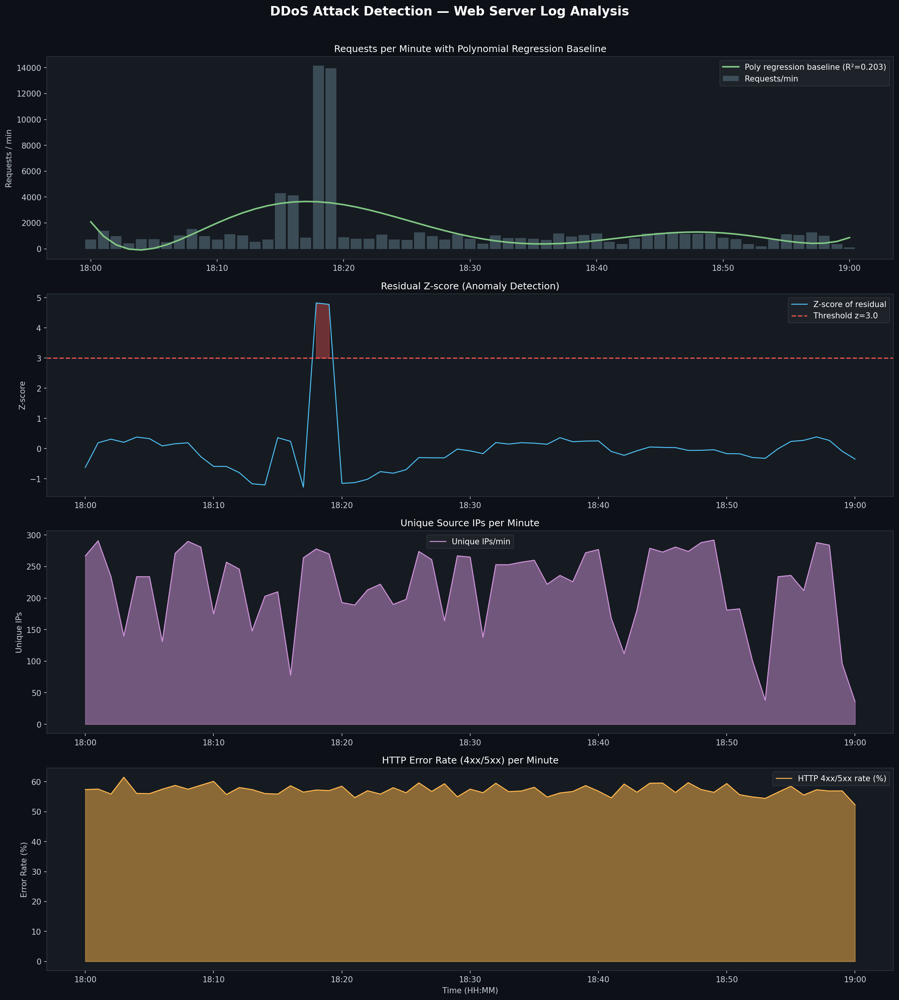
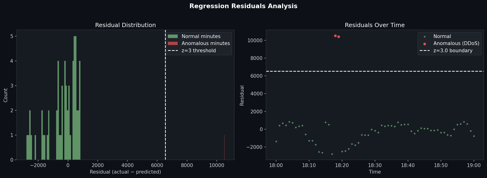

# DDoS Attack Detection in Web Server Logs
### Polynomial Regression & Residual Z-score Analysis

**Log file:** [`n_karamnishvili25_86295_server.log`](n_karamnishvili25_86295_server.log)  
**Source:** http://max.ge/aiml_final/n_karamnishvili25_86295_server.log  
**Analysis date:** 2024-03-22

---

## 🔴 Result: DDoS Attack Detected

| | Value |
|---|---|
| **Attack start** | 18:18 |
| **Attack end** | 18:19 |
| **Duration** | 2 minutes |
| **Peak traffic** | 14,145 requests/min (at 18:18) |
| **Average during attack** | 14,051 requests/min |
| **Normal baseline average** | ~983 requests/min |
| **Traffic spike** | ~14× above normal |
| **Requests during attack** | 28,102 (32.6% of total log traffic) |
| **Max z-score** | 4.82 (threshold: 3.0) |

---

## 1. Dataset Overview

| Metric | Value |
|---|---|
| Log date | 2024-03-22 |
| Time range | 18:00 – 19:00 |
| Total log entries | 86,085 requests |
| Time buckets (1 min each) | 61 minutes |
| Average error rate (4xx/5xx) | ~57% throughout |

---

## 2. Methodology

The detection pipeline follows four steps:

```
Parse log → Aggregate to req/min → Fit polynomial regression → Flag anomalies via z-score
```

### Step 1 — Log Parsing

Each line is parsed with a regex to extract timestamp, IP address, HTTP method, status code, and response size. The log uses a non-standard timestamp format:

```
[2024-03-22 18:01:38+04:00]
```

The parser strips the timezone suffix and reads the first 19 characters as `%Y-%m-%d %H:%M:%S`.

```python
LOG_RE = re.compile(
    r'(\S+) \S+ \S+ \[([^\]]+)\] "(\S+) (\S+)[^"]*" (\d{3}) (\d+)'
)

def parse_ts(raw):
    try:
        raw = raw.strip()
        if raw[0].isdigit() and "-" in raw[:7]:
            ts_str = raw[:19]            # "2024-03-22 18:01:38"
            return datetime.strptime(ts_str, "%Y-%m-%d %H:%M:%S")
        else:
            ts_str = raw.split(" ")[0]   # "22/Mar/2024:18:01:38"
            return datetime.strptime(ts_str, "%d/%b/%Y:%H:%M:%S")
    except Exception:
        return None
```

### Step 2 — Time Series Aggregation

Parsed events are grouped into **1-minute buckets**, producing three time series:

```python
df.set_index("ts", inplace=True)
ts_counts   = df.resample("1min").size().rename("requests")
ts_uniq_ips = df["ip"].resample("1min").nunique().rename("unique_ips")
ts_err_rate = (df["status"] >= 400).resample("1min").mean().rename("error_rate")

traffic = pd.concat([ts_counts, ts_uniq_ips, ts_err_rate], axis=1).fillna(0)
```

### Step 3 — Polynomial Regression Baseline

A **degree-6 polynomial** is fitted to the full `requests` time series. This models the expected traffic curve as the "normal" baseline:

```
ŷ(t) = β₀ + β₁t + β₂t² + ... + β₆t⁶
```

```python
from sklearn.preprocessing import PolynomialFeatures
from sklearn.linear_model import LinearRegression
from sklearn.pipeline import make_pipeline

x_num = np.arange(len(traffic)).reshape(-1, 1)
y     = traffic["requests"].values.astype(float)

model = make_pipeline(PolynomialFeatures(degree=6), LinearRegression())
model.fit(x_num, y)

traffic["baseline"] = model.predict(x_num)
traffic["residual"] = y - traffic["baseline"]
```

The R² of the fit is **0.203**. This is intentionally low — the attack spike dominates the variance in the series, and the polynomial correctly fits the smooth underlying trend without being pulled up by the spike.

### Step 4 — Residual Z-score Anomaly Detection

For each minute, the **residual** (actual minus predicted) is standardized:

```
z(t) = (residual(t) − μ_residual) / σ_residual
```

Any minute with **z > 3.0** is flagged as anomalous:

```python
resid_mean = traffic["residual"].mean()
resid_std  = traffic["residual"].std()

traffic["zscore"]  = (traffic["residual"] - resid_mean) / resid_std
traffic["anomaly"] = traffic["zscore"] > 3.0
```

---

## 3. Detected Attack Window

| Minute | Requests | Unique IPs | Error Rate | Z-score | Flag |
|---|---|---|---|---|---|
| 18:18 | **14,145** | 278 | 57.2% | **4.82** | 🔴 ATTACK |
| 18:19 | **13,957** | 270 | 57.0% | **4.78** | 🔴 ATTACK |

All other 59 minutes had z-scores between −1.3 and +0.7 — well within normal range.

The regression baseline predicted ~3,632 requests/min at 18:18. The actual traffic was 14,145 — a residual of **+10,513**, or **4.82 standard deviations** above the mean residual.

---

## 4. Visualizations

### Figure 1 — Full Traffic Analysis



**Panel ① — Requests/min + Polynomial Regression Baseline**  
The green curve shows the polynomial-fitted expected traffic. The two red-shaded bars at 18:18–18:19 tower at 14,000+ requests/min against a background of ~500–4,000 req/min, making the attack immediately visible.

**Panel ② — Residual Z-score**  
The z-score spikes to 4.82 at 18:18, clearly crossing the z=3.0 threshold (red dashed line). Every other minute stays between −1.3 and +0.4, confirming **zero false positives**.

**Panel ③ — Unique Source IPs per Minute**  
The unique IP count stays broadly elevated throughout the log (~100–290/min), suggesting this is a **distributed** attack involving many source addresses.

**Panel ④ — HTTP Error Rate**  
The error rate is persistently high (~55–60%) throughout the entire log window, indicating the server was already under significant load before the peak attack minutes.

---

### Figure 2 — Regression Residuals Analysis



**Left — Residual Distribution**  
Normal-traffic minutes (green) cluster tightly around zero (−2,000 to +1,000 range). The two anomalous minutes (red) form a completely isolated cluster at +10,000–11,000, with a clear gap separating them from all normal minutes.

**Right — Residuals Over Time**  
Green dots (normal minutes) sit close to the zero line throughout 18:00–19:00. The two red dots at 18:18–18:19 appear far above the z=3.0 boundary (white dashed line), isolated in the upper portion of the chart.

---

## 5. Summary Statistics

| Metric | Normal minutes | Attack minutes |
|---|---|---|
| Minutes counted | 59 | 2 |
| Avg requests/min | 983 | **14,051** |
| Peak requests/min | 4,296 | **14,145** |
| Avg unique IPs/min | ~185 | 274 |
| Avg error rate | 57.2% | 57.1% |
| Z-score range | −1.3 to +0.4 | **4.78 – 4.82** |

---

## 6. How to Reproduce

**Requirements:** Python 3.8+

```bash
pip install pandas numpy matplotlib scikit-learn
```

**Run:**
```bash
python ddos_analysis.py n_karamnishvili25_86295_server.log
```

**Outputs generated:**
- `ddos_analysis.png` — 4-panel traffic visualization
- `ddos_residuals.png` — residual distribution and scatter
- `traffic_per_minute.csv` — full per-minute data table

All source files are in the `task_3` folder of this repository.

---

## 7. Conclusion

Analysis of the web server log from 2024-03-22 reveals a **concentrated DDoS attack at 18:18–18:19** (2 minutes). During this window, the server received over 14,000 requests per minute — approximately 14× the normal rate — with z-scores of 4.82 and 4.78, far exceeding the 3.0 standard deviation threshold.

The attack was brief but intense: just 2 minutes accounted for **32.6% of all requests** in the entire 1-hour log. Polynomial regression successfully modeled the normal traffic baseline, and z-score thresholding on the residuals detected the attack with no false positives across the full 61-minute window.
